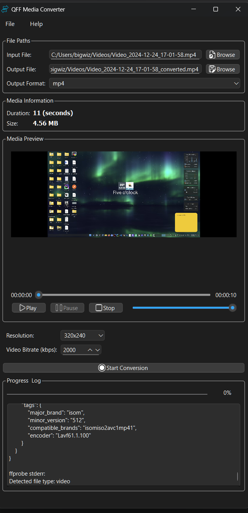

# QFF Media Converter - Convert Media Files from  **`any`**  to **`any`**  Format


[](https://github.com/aamitn/qff-media-converter/actions/workflows/cmake.yml)
[](./LICENSE)
[](https://github.com/aamitn/Winhider/releases/)

[**_Latest Releases_**](https://github.com/aamitn/qff-media-converter/releases/latest)

| **Platforms**    | **Link**                                                                                                                                                                                            |
|---------------------|-----------------------------------------------------------------------------------------------------------------------------------------------------------------------------------------------------|
**Windows**  | [Installer/EXE](https://github.com/aamitn/qff-media-converter/releases/latest/download/qff_installer.exe) • [Zip/Portable](https://github.com/aamitn/qff-media-converter/releases/latest/download/dist.zip) |
| **Linux** | [RPM](hhttps://github.com/aamitn/qff-media-converter/releases/latest/download/qffgui-1.2.11-Linux.rpm) • [DEB](https://github.com/aamitn/qff-media-converter/releases/latest/download/qffgui-1.2.11-Linux.deb) • [.TAR.GZ](https://github.com/aamitn/qff-media-converter/releases/latest/download/qffgui-1.2.11-Linux.tar.gz)                                         |
| **MacOS** | [App](https://github.com/aamitn/qff-media-converter/releases/latest/download/qffgui-macos.zip ) • [DMG](https://github.com/aamitn/qff-media-converter/releases/latest/download/qffgui.dmg) |


**QFF Media Converter** is a lightweight, Qt-based front-end application that simplifies media conversion tasks using the powerful FFmpeg engine. Developed by [Bitmutex Technologies](https://www.bitmutex.com), the tool provides an intuitive UI for converting audio, image  and video files from  _**`any`**_  to _**`any`**_  formats.

Website Repo for docs and landing : [`https://github.com/aamitn/qff-media-converter`](https://github.com/aamitn/qff-media-converter)
[](https://github.com/aamitn/winhider-website/actions/workflows/astro.yml)


## Glimpse of the GUI and CLI
<p float="left">
  
</p>
---

## 🚀 Features

- 🎞️ Convert audio and video and image files from `any`-to-`any` formats using FFmpeg
- 📈 Visualize audio waveforms in real-time
- 🔄 Integrated auto-updater with support for GitHub releases
- 📦 FFmpeg auto-download and installation
- 🐍 Python-based update helper script for smooth file replacement
- 🪟 Cross-platform (Windows & Linux), with dynamic script handling
- 🌍 Internationalization support via `.ts` translation files
- 🧰 Minimal external dependencies (uses system libraries only)

---

## 🧑‍💻 Getting Started

### ⚙️ Prerequisites

- Qt 6.9.x (Tested with Qt 6.9.1)
- CMake 3.16+
- Python 3.8+ (auto-installed if not found)
- Git (optional for CI/CD or updates from GitHub)

---

### 🔨 Build Instructions

**Prerequisites** :
- [Download Qt](https://www.qt.io/download-qt-installer-oss)
- [Download FFMpeg](https://github.com/btbn/ffmpeg-builds/releases) - [Alternate Link](https://www.gyan.dev/ffmpeg/builds)

**Clone Repo** 
```sh
git clone https://github.com/aamitn/qff-media-converter
cd qff-media-converter
```

#### Using Qt Creator

- Open `CMakeLists.txt` in Qt Creator.
- Configure the kit and run the project.
- Build and Run in IDE


#### Manual Builds - For Windows, Linux and MacOS

#### Windows
- Configure
  ```sh 
  cmake -DCMAKE_PREFIX_PATH=C:\Qt\6.9.1\msvc2022_64 -S . -B .\build
  ```

- Build
  ```sh 
  cmake --build .\build
  ```
> Generates protab/zip, installer/exe

#### Linux
- Install Dependencies
  ```sh 
  sudo apt install rpm 
  ```

- Configure (Change <username>)
  ```sh 
  cmake -DCMAKE_PREFIX_PATH=/home/<username>/Qt/6.9.1/gcc_64 -S . -B ./build
  ```

- Build
  ```sh 
  cmake --build ./build
  ```
  

- Install
  ```sh 
  sudo cmake --install ./build
  ```

- Package (Method A)
  ```sh 
  cmake --build ./build --target package
  ```
  > Find packages under ./build/_Cpack_Packages/

- Package (Method B)
  ```sh 
  cd build && cpack -G DEB && cpack -G TGZ && cpack -G RPM
  ```
  > Find packages under ./build/

- Run App
  ```sh 
  qffgui
  ```
> Use :: `LD_LIBRARY_PATH=/usr/local/lib:$LD_LIBRARY_PATH qffgui` if you have startup errors

> Generates tar.gz,deb,rpm

#### MacOs
- Configure
  ```sh 
  cmake -DCMAKE_PREFIX_PATH=/home/<username>/Qt/6.9.1/gcc_64 -S . -B ./build
  ```

- Build
  ```sh 
    cmake --build ./build
  ```

- Generate DMG
  ```sh

  /home/<username>/Qt/6.9.1/macos/bin/macdeployqt/macdeployqt ./build/qffgui.app -dmg -qmldir="./"
  ```
> Generates app,dmg


## 📦  FFmpeg Integration

If FFmpeg is not found on the user's system, the application automatically downloads and installs it from a pre-defined location. This logic is handled in:
- `ffmpegutils.cpp`
- `unzip_ffmpeg.py`

##  🔄 Auto-Update Mechanism

The update manager checks GitHub releases and downloads .zip assets, which are extracted and installed via:
    - `update_helper.py`: a cross-platform update script written in Python.
    -`updatemanager.cpp`: integrates with GitHub's REST API.
    - Automatically restarts the app after copying updated files.
>Auto-Updates can e tunrned off from UI Menu

💬 Translations

Translation support via Qt Linguist .ts files is available. Contributions welcome.


🤝 Contributing
**License** :: This project is licensed under the MIT License.

Pull requests and feature suggestions are welcome! For major changes, please open an issue first.